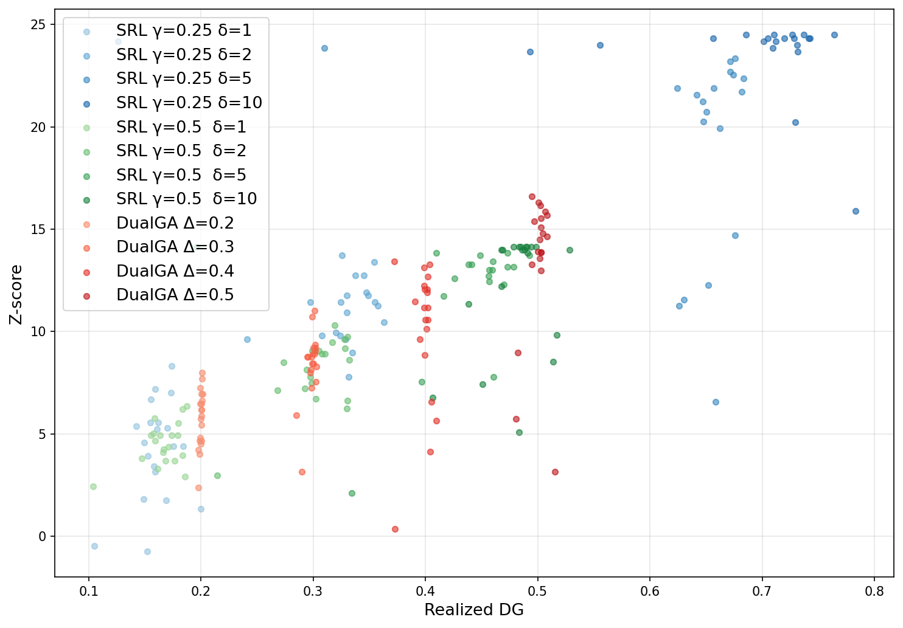
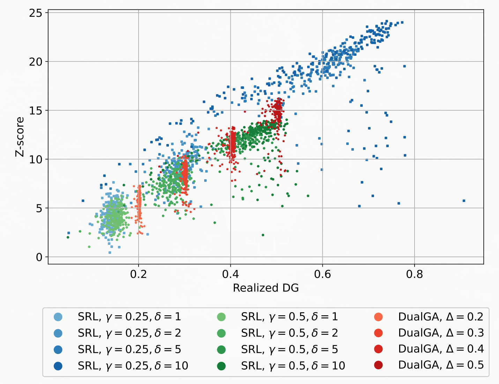

# Towards Better Statistical Understanding of Watermarking LLMs

This is my final project for CMPSC 292F: Information-theoretic Methods for Trustworthy Learning at UC Santa Barbara.
It's a presentation on Cai et al.'s 2024 paper _Towards Better Statistical Understanding of Watermarking LLMs_.

The slides are located in `main.pdf` and the original paper (from arxiv) is located at `paper.pdf`.
I forgot we needed to include a discussion section originally, so I added one after giving the presentation.

This repo is a fork of their original repo, so that I could reference their code while recreating some of their results.
Unfortunately, they didn't include any notebooks replicating their figures, just their underlying algorithms.

So I replicated the first figure from scratch in `./figure1_replication.py`, producing

vs their original figure

This uses all the same settings, just with a smaller model (350M param Meta LLM vs their 7B param model.)

I also have `demo_output.py`, which allows you to generate text on your own from an arbitrary LLM, showing the difference between regular text and watermarked text (wasn't shown in the presentation because the live demo was too slow).

## Running the code

Install `uv` and create and enter your virtual environment via `uv sync` and `source ./venv/bin/activate` (this will automatically install all dependencies).
Then run `python figure1_replication.py` and `python demo_output.py`, respectively.

## Discussion

I forgot we needed to include this in the presentation so I'll just briefly note here my assessment.

